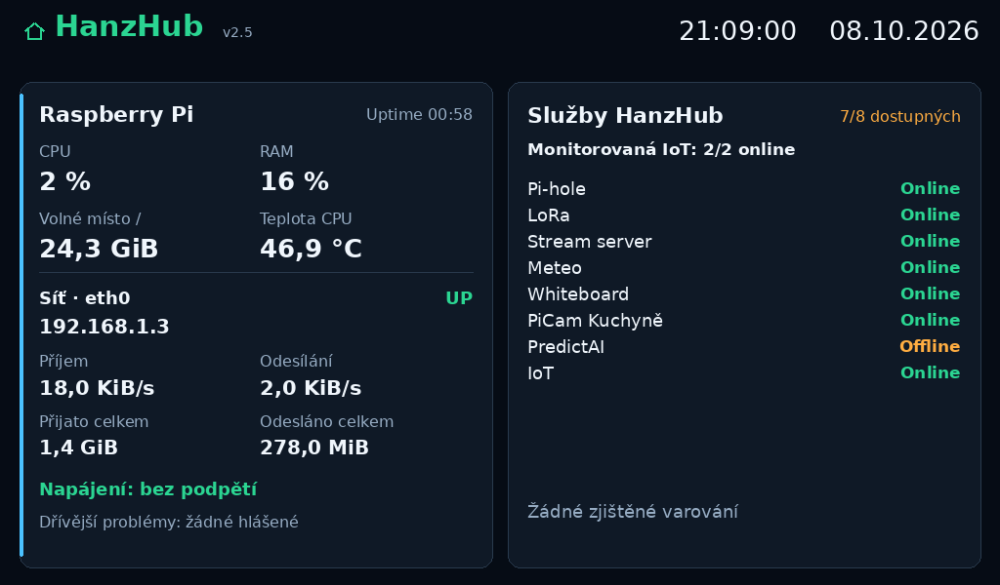
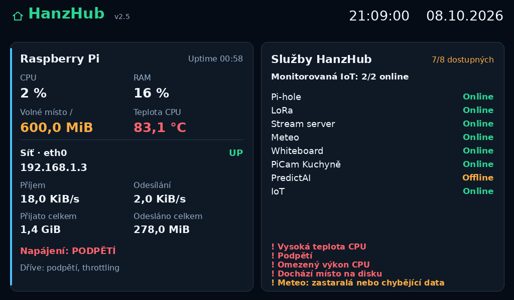

# HanzHub · Infopanel v2

Dotykový informační panel pro Raspberry Pi: stručný přehled systému, Meteo a IoT, graf teploty, ovládání infrapanelu BOT IPH2 a zásuvky TP-Link Tapo P110M. Grafika navazuje na tmavý styl HanzHubu. Verze **2.5.0** podporuje samostatné rozložení **320 × 480 na výšku** a **1024 × 600 na šířku**, vhodné pro Waveshare 7inch HDMI LCD (C).





Obrázek vzniká přímo z vykreslovacího kódu. Čísla i průběhy v tomto náhledu jsou **ukázková data**. Nasazená aplikace načítá skutečné údaje.

## Stránky a dotyk

| Stránka | Zobrazení a ovládání |
| --- | --- |
| **Hlavní stránka na šířku** | Větší HanzHub s malou verzí v2.5, čas a datum, CPU, RAM, disk, teplota Raspberry, uptime, online/celkové monitorované IoT a dostupné/celkové služby dashboardu. IP je pouze v rozšířeném přehledu. Varování při problému a stáří posledního Meteo měření. Jednoduché dlaždice Meteo (teplota/baterie), infrapanelu (cílová teplota/ON či OFF) a zásuvky (příkon/ON či OFF). |
| **Meteo** | Teplota, baterie, čas i stáří posledního měření a graf za 1 / 6 / 24 hodin; minimum a maximum. |
| **Infrapanel** | Cílová a aktuální teplota, tlačítka − / +, zapnutí/vypnutí, dětský zámek a časovač vypnuto / 1 / 2 / 4 / 8 / 24 hodin. Rozsah cíle 0–37 °C. |
| **Rozšířený přehled** | Dotykem na HanzHub z hlavní obrazovky s dlaždicemi: volné místo, CPU/RAM/teplota/uptime, vybrané síťové rozhraní a IPv4, příjem/odesílání, firmware a jednotlivé služby. Delší seznam služeb lze přepínat šipkami. |
| **Zásuvka** | Aktuální příkon, dnešní/měsíční energie, místní graf příkonu za 1 / 6 / 24 hodin a zapnutí/vypnutí. |

Klepnutím na dlaždici na hlavní stránce otevřeš detail. **Klepnutí na HanzHub z hlavní stránky s dlaždicemi otevře rozšířený přehled systému a služeb. Ze všech ostatních stránek, včetně rozšířeného přehledu a časovače, HanzHub vrací na dlaždice.** Systémový pás už není tlačítko. **Na šířku není spodní navigace. Hlavička je jednotná: HanzHub, malá verze v2.5, čas a datum; bez názvu stránky a bez IP.** Původní výškový profil si ponechává spodní navigaci. Po 60 sekundách nečinnosti se displej vrátí na Přehled; interval lze změnit. Aktivní dotykové plochy mají při rozlišení 320 × 480 alespoň 44 pixelů v obou směrech; v rozložení 1024 × 600 alespoň 60 pixelů. Ověřeno je i zmenšení širokého rozložení na 800 × 480, kde mají plochy alespoň 44 pixelů.

Na šířku jsou **minimalistické dlaždice v mřížce až 3 × 3**. Vlevo nahoře mají ikonku a název, vpravo sekundární údaj nebo stav, uprostřed velkou hodnotu s jednotkou. Zobrazené dlaždice a jejich pořadí vybírá `home_tiles`. Nyní jsou podporované tři typy: `meteo`, `heater`, `plug`, každý jednou. Mřížka má kapacitu devět dlaždic pro budoucí typy; další zařízení či typy tímto nevznikají a nevyplňujeme volná místa kopiemi. Systémové údaje a počet služeb jsou pod oddělovací čarou v horní části, tučně (18 px) s vysokým kontrastem. CPU, RAM, disk, teplota, uptime a dostupné služby mají pevné sloupce; IoT online je na druhém řádku spolu s případnými varováními. Číselné hodnoty i jejich jednotky mají pevné pozice, takže změna z 2 na 100 % neposune sousední údaje. HanzHub má na šířku 30 px, verze 14 px; čas i datum zachovávají 27 px. Grafy a další měření zůstávají v detailech. Detail Meteo má velký graf a samostatný sloupec s měřením a baterií. Infrapanel má velký teplotní kruh a ovládání vedle něj; zásuvka měření a vypínač vedle grafu. Napětí a proud zásuvky se zobrazí, pokud je API poskytuje. Jednotlivé stránky se vejdou na obrazovku bez posouvání; seznam více než osmi služeb v detailu Raspberry používá šipky (ve výškovém profilu po čtyřech).

**ON je zeleně, OFF červeně, nedostupné zařízení oranžově.** OFF znamená ověřený stav vypnutí; výpadek komunikace se zobrazuje samostatně. Na minimalistické dlaždici znamená oranžová pomlčka nedostupný či pozastavený modul; detail stav vysvětlí. Starší Meteo teplota se na dlaždici zbarví oranžově, detail přidá upozornění. Chybějící měření nezobrazujeme jako nulu. ON infrapanelu neznamená, že jeho topné těleso právě odebírá proud.

## Hlavička a navigace (2.4.0)

Aplikace po startu a po návratu z nečinnosti otevírá **hlavní stránku s dlaždicemi**. Rozšířený přehled systému a služeb je další obrazovka. HanzHub na hlavní stránce ho otevře; z každého detailu vrací na dlaždice. Klikací je i oblast s malou verzí vedle loga. Názvy Meteo/Infrapanel/Zásuvka/Raspberry zůstávají jen uvnitř obsahu, v hlavičce se neopakují. IP je dostupná v síťové části rozšířeného přehledu, hlavní stránka ji nezobrazuje. Výškový profil má také jednotné logo/verzi a stejný princip přepínání přes HanzHub.

Plná verze aplikace je **2.5.0** (CLI `--version`, logy a náhledy); hlavička z ní automaticky používá krátký tvar **v2.5**. Odložené odeslání teploty po 2 s bez dalšího klepnutí zůstává zachované i při navigaci.

## Rozšířený přehled a varování (od 2.3.0)

- **IoT online** počítá aktivní vybrané moduly, které tento LCD monitoruje (`panel_id` a `plug_id`, případně automaticky zvolené jediné zařízení příslušného typu). Jde o potvrzené spojení, **OFF se počítá jako online**. Pozastavené nebo odstraněné moduly jsou z počtu vynechané. Počet není inventář všech modulů v IoT aplikaci. Při nedostupném či starém seznamu modulů je údaj neznámý; potvrzení stavu zařízení starší než `max(25 s, 3 × iot_refresh)` se nezapočítá jako online.
- **Stáří Meteo** se počítá ze skutečného času posledního měření, nikoli času načtení souboru. Dlaždice i detail ukazují sekundy/minuty/hodiny/dny. Nad `meteo_stale` (výchozí 3 600 s) jsou data oranžová a objeví se varování. Chybějící měření má neznámé stáří.
- **Varování na hlavní stránce**: CPU od 80 °C; hlášené aktuální podpětí, omezení výkonu nebo teplotní limit; disk `/` zaplněný alespoň z 90 % nebo s méně než 1 GiB volného místa. Jsou to prahy upozornění aplikace, aplikace nic automaticky nevypíná. Řádek s varováním má přednost před potvrzením příkazu; úplný seznam se vejde do detailu Raspberry.
- **Napájení a firmware** se pouze čtou přes `vcgencmd get_throttled`. Chybějící nástroj, chyba oprávnění, neplatná odpověď nebo timeout znamenají „neznámé“, nikdy potvrzení zdravého napájení. Nízké bity znamenají aktuální stav; historické bity 16–19 zobrazujeme samostatně jako „Dříve“, bez aktuálního alarmu. Význam bitů popisuje [oficiální dokumentace Raspberry Pi](https://www.raspberrypi.com/documentation/raspbian/README.md#get_throttled). Ověření na HUBu: `vcgencmd get_throttled`.
- **Síť** používá rozhraní z `iface` (výchozí `eth0`). RX/TX jsou bajty za sekundu z rozdílu dvou vzorků; první vzorek, odpojení nebo reset čítače mají neznámou rychlost. Celkové přenosy jsou kernelové čítače daného rozhraní od jeho inicializace/resetu, nikoli denní spotřeba. Jednotky KiB/MiB/GiB jsou násobky 1 024. Volné místo se týká kořenového souborového systému `/`.
- Systém se vzorkuje na pozadí po 2 s, `vcgencmd` má timeout 1 s. Systémový vzorek starý 10 s se přestane zobrazovat. Čekání na systém ani health API neblokuje dotykové ovládání. Detail služeb ukazuje **HTTP dostupnost z dashboardu**, nikoli interní stav všech procesů/systemd jednotek.



## Co musí na Raspberry fungovat

- Linux framebuffer `/dev/fbX`, obvykle `/dev/fb0` nebo `/dev/fb1`; podporované formáty RGB565 (16 bitů) a BGRX8888 (32 bitů). Výchozí `layout: auto` vybere rozložení podle rozlišení **po započtení rotace**: širší obraz používá profil 1024 × 600, ostatní profil 320 × 480. Otočení lze převzít z původní služby. Jiná rozlišení zachovávají poměr stran vybraného profilu, případně s okraji.
- Dotyk dostupný přes Linux input/evdev: `ABS_X/Y + BTN_TOUCH` (např. resistivní čidlo), nebo multitouch protokol B se sloty. Ovladač displeje/dotyku musí být už nainstalovaný. Instalátor nezasahuje do boot konfigurace ani SPI overlay.
- Existující [HanzHub IoT služba](https://github.com/H0nz4k/LoT) dostupná na `http://127.0.0.1:4011/api/iot`, s již přidaným infrapanelem a zásuvkou. API lze použít i z jiného počítače v LAN.
- Pro počet služeb používáme GET `http://127.0.0.1:4010/api/health` z existujícího dashboardu. Počet znamená dostupné/celkové služby podle HTTP health kontrol, nikoli počet všech systemd jednotek. Kontrola běží na pozadí každých 30 s; při chybě nebo stáří nad 90 s ukážeme pomlčku.
- Pro Meteo log `/opt/meteo3/meteo_log.csv`, řádky ve stejném formátu jako původní LCD:

```text
2026-10-08T21:00:00+02:00,{"temp":21.48,"vbat":3.728,"soc":27}
```

Infopanel kreslí přímo na LCD, **nepotřebuje Chromium ani desktop a neotvírá nový webový port**. Stav a příkazy předává existující službě na portu 4011. Neukládá Tapo účet, heslo ani Tuya lokální klíč; ty spravuje IoT služba.

## Instalace na současném HUBu

```bash
sudo apt update
sudo apt install -y git python3-pil python3-psutil python3-evdev python3-libgpiod fonts-dejavu-core
sudo git clone https://github.com/H0nz4k/InfoLcd.git /opt/InfoLcd
cd /opt/InfoLcd
sudo python3 install.py
```

Výchozí původní služba je `lcd-info.service`. Instalátor z jejího `ExecStart` převezme framebuffer, otočení, font, Meteo log, síťové rozhraní a URL/ID infrapanelu. Při aktualizaci zachová existující nastavení Infopanelu v2.

Nejprve ověří závislosti, konfiguraci, framebuffer a dotyk **bez změny stavu zařízení a bez zastavení původní služby**. Teprve po úspěšné kontrole uloží zálohu, zastaví původní vykreslování a zapne `infopanel.service`. Při neúspěšném spuštění obnoví předchozí soubory a stav služeb. Původní LCD skript ani jeho unit nepřepisuje. Služby mají `Conflicts`, aby nekreslily současně.

Samotná kontrola bez přepnutí služeb:

```bash
sudo python3 install.py --check-only
```

Pokud má stará služba jiné jméno, framebuffer nebo je potřeba explicitně vybrat vstup:

```bash
sudo python3 install.py --legacy-service lcd-info.service --fb /dev/fb1 --rotate 0 --touch /dev/input/event0
```

Čísla `/dev/fb1` a `event0` jsou **příklad**, použij skutečná zařízení. Diagnostika je vypíše:

```bash
sudo python3 lcd/infopanel.py --diagnose
```

Automatický výběr dotyku funguje při právě jednom podporovaném vstupu. Při více vstupech instalace skončí s vysvětlením a původní LCD zůstane běžet. Trvalá cesta `/dev/input/by-path/…` je vhodnější než číslo `eventX`, pokud ji ovladač poskytuje.

Verze **2.1.1** zvětšuje drobné popisky a osy grafů v rozložení na šířku na 16 px. Datum má stejný font, velikost 27 px a zarovnání jako čas. Aktualizace zachovává konfiguraci displeje, dotyku i zařízení.

## Přechod na 7″ HDMI displej na šířku

Waveshare 7inch HDMI LCD (C) má obraz přes HDMI a dotyk přes datové USB. Aplikace nadále používá framebuffer a evdev. Konfigurace a přidané IoT moduly zůstávají v existujících službách; LCD nemusí zařízení znovu párovat.

Po připojení HDMI a USB nejprve aktualizuj zdrojové soubory a zjisti skutečný framebuffer a dotyk:

```bash
cd /opt/InfoLcd
git pull --ff-only
sudo python3 lcd/infopanel.py --diagnose --fb /dev/fb0 --rotate 0
```

`/dev/fb0` je příklad pro HDMI. Pokud diagnostika ukáže jiný displej, použij odpovídající `/dev/fbX`. Pro 7″ panel očekáváme obraz 1024 × 600, logické rozlišení 1024 × 600 a rozložení `landscape`. Pokud je fyzická orientace správná, nastav `rotate: 0`; nepřebírej rotaci původního SPI LCD.

Příklad pro **ověřený HDMI framebuffer `/dev/fb0`** a jediný připojený dotykový vstup:

```bash
sudo python3 install.py --fb /dev/fb0 --rotate 0 --touch auto --layout auto --check-only
sudo python3 install.py --fb /dev/fb0 --rotate 0 --touch auto --layout auto
```

Při více dotykových zařízeních nahraď `auto` cestou USB dotyku z diagnostiky. Po změně displeje se automaticky zopakuje čtyřbodová kalibrace. Rotace otáčí obraz, volba `layout` mění rozložení; jde o dvě samostatná nastavení. Rozložení lze vynutit pomocí `--layout landscape` nebo `--layout portrait`.

Instalátor nenastavuje HDMI rozlišení ani neodstraňuje staré SPI/display overlay z boot konfigurace. Pro uvolnění GPIO je po odebrání původního LCD potřeba odstranit jeho konkrétní overlay podle konfigurace daného Raspberry. Tuto změnu nelze spolehlivě odvodit pouze z typu nového displeje.

## Ovládání podsvícení

Zapojení pro ovládání podsvícení přes relé Omron G5V-1-DC5 je popsáno v [hardwarovém návodu](docs/backlight-relay.md), včetně [schématu a součástek v PDF](docs/backlight-relay.pdf). Jde o návrh zapojení; před montáží je potřeba určit kontakty přepínače konkrétního LCD. Samostatné [skripty podsvícení](gpios/README.md) ovládají BCM GPIO21 (fyzický pin 40) a instalují se do `/opt/gpios`. ON znamená LOW a vypnutou cívku, OFF znamená HIGH a buzenou cívku; používáme NC kontakt relé. Od verze 2.5.0 podsvícení ovládá aplikace přímo přes libgpiod: klepnutí na čas/datum vpravo nahoře zhasne. První platné klepnutí kamkoliv znovu rozsvítí a neprovede žádný skrytý příkaz. Funguje na všech stránkách i v dialogu časovače. USB napájení a dotyk LCD zůstávají připojené; relé přepíná pouze kontakty podsvícení. Aplikace začne s GPIO21 LOW (podsvícení ON) a při běžném ukončení vrací výstup do LOW. Stav je poslední úspěšný zápis GPIO, nikoli měření skutečného světla. **Samostatné skripty pinctrl používej pouze se zastaveným infopanel.service**, jinak mohou obejít kernelovou rezervaci a rozhodit stav aplikace.

## Podsvícení a haptická odezva (2.5.0)

**GPIO21 = podsvícení, GPIO20 = vibrační motůrek. Čísla jsou BCM: fyzické piny 40 a 38.**
Motůrek ovládej přes tranzistor/MOSFET nebo vhodný budič, s ochrannou diodou a společnou zemí.
Napájení motůrku musí odpovídat jeho jmenovitému napětí; na GPIO se připojuje pouze řídicí vstup.
Podrobné propojení a součástky jsou v [návodu pro haptiku](docs/haptics.md).

Při **přijatém klepnutí na aktivní ovládací prvek** krátce zavibruje (výchozí 50 ms).
Platí i pro navigaci, změnu období grafu, +/− a kalibrační body. Klepnutí do prázdna,
přetažení prstu, nepřijatý příkaz nebo nedostupné ovládání nevibrují. Odezva potvrzuje
přijetí klepnutí aplikací, **nikoli úspěšné vykonání vzdáleného IoT příkazu**.
Motůrek obsluhuje samostatné vlákno; rychlá klepnutí neprodlužují rozběhnutý pulz,
mezi pulzy je 30 ms pauza a může čekat nejvýše jeden další pulz. Nemůže vzniknout dlouhá fronta vibrací.
Při běžném ukončení se motor vypne. Externí odpor stahující řídicí vstup k zemi je nutný i pro stav při bootu či pádu procesu.

Na současném Debianu Trixie doplň závislost a aktualizuj:

```bash
sudo apt update
sudo apt install -y python3-libgpiod
cd /opt/InfoLcd
sudo sh update.sh
sudo journalctl -u infopanel.service -n 30 --no-pager
```

Pro provoz potřebujeme **libgpiod 2.x**. GPIO se vyhledají podle konektoru Raspberry a názvů linek;
číslo `/dev/gpiochipN` nemusí být stejné na všech jádrech. Aplikace drží linky po celou dobu běhu,
a pokud je již používá jiný ovladač, nevynucuje jejich přenastavení. GPIO20/21 nesmějí být současně
použité například pro I²S/PCM či SPI1. Instalátor boot konfiguraci nemění.
Chybějící knihovna, GPIO nebo obsazená linka se vypíše do logu, zbytek panelu dál funguje.
Podsvícení a motor jsou nezávislé: chyba jednoho nevypne druhý. Bez dostupného výstupu podsvícení hodiny nefungují jako vypínač.
Kontrola `--check` / `--check-only` pouze čte informace o GPIO, nemění úroveň ani nevibruje.

Nastavení v `/etc/hanzhub-infopanel.json` (instalátor je doplní při aktualizaci):

```json
"backlight_gpio": 21,
"haptic_gpio": 20,
"haptic_ms": 50
```

Každý GPIO lze vypnout hodnotou `null`, například `"haptic_gpio": null`, než bude motůrek připravený.
Povolená délka pulzu je 10–150 ms. Změnu konfigurace načte `sudo systemctl restart infopanel.service`.
Tato verze nemá automatické zhasínání ani uložený stav OFF po restartu; návrat na dlaždice po nečinnosti nezhasíná.

## První spuštění: kalibrace

Klepni postupně na **čtyři křížky** v rozích obrazovky a vždy zvedni prst. Do dokončení kalibrace nejsou přístupná ovládací tlačítka. Kalibrace řeší prohozené osy, zrcadlení i nastavené otočení; při nepřesných bodech se zopakuje.

Výsledek se ukládá do `/var/lib/hanzhub-infopanel/touch-calibration.json`. Změna rozlišení, rotace nebo identifikace vstupního zařízení vyvolá novou kalibraci. Ruční zopakování:

```bash
sudo systemctl stop infopanel.service
sudo rm -f /var/lib/hanzhub-infopanel/touch-calibration.json
sudo systemctl start infopanel.service
```

Dotyk provede akci až při uvolnění prstu. Tažení, druhý multitouch kontakt a ztracené input události nevydávají příkaz. Při čekání na odpověď jsou ovládací tlačítka zamknuta, navigace zůstává dostupná.

## Nastavení a výběr modulů

Nastavení je v **`/etc/hanzhub-infopanel.json`**; popisuje ho [config.example.json](config.example.json).

| Klíč | Výchozí hodnota / význam |
| --- | --- |
| `fb`, `rotate` | `/dev/fb0`, `0`; rotace 0 / 90 / 180 / 270 proti směru hodin |
| `layout` | `auto`: výběr podle orientace obrazu po rotaci; `portrait` / `landscape` vynutí profil |
| `touch` | `auto` nebo cesta podporovaného input zařízení |
| `api` | `http://127.0.0.1:4011/api/iot` |
| `health_api` | `http://127.0.0.1:4010/api/health`; zdroj počtu služeb dashboardu |
| `home_tiles` | `["meteo", "heater", "plug"]`; výběr a pořadí dlaždic na šířku, bez opakování |
| `panel_id`, `plug_id` | `null` pro první automatický výběr jednoho modulu daného typu; jinak explicitní ID modulu |
| `meteo_csv` | `/opt/meteo3/meteo_log.csv` |
| `meteo_refresh`, `meteo_stale` | Čtení logu každých 15 s; označení starších dat po 3600 s |
| `iot_refresh` | Polling každých 5 s; respektuje také cache IoT API |
| `idle_seconds` | Návrat na Přehled po 60 s; `0` návrat vypne |
| `iface` | `eth0`, lze změnit např. na `wlan0` |
| `data_dir` | `/var/lib/hanzhub-infopanel`; kalibrace, výběr modulů a historie příkonu |

Pro zobrazení jen některých dlaždic změň např. `"home_tiles": ["plug", "heater"]` v konfiguraci a restartuj `infopanel.service`. Změna seznamu nespáruje ani neodebere zařízení.

Pokud máš jeden infrapanel a jednu Tapo P110M, načtou se automaticky. Vybraná **ID se uloží**, aby odebrání zařízení omylem nepřesměrovalo ovládání na jiný modul. Při více zařízeních stejného typu nastav `panel_id` / `plug_id`. Jde o **12místné ID z HanzHubu**, nikoli dlouhý Tuya Device ID. Získáš je:

```bash
curl -sS http://127.0.0.1:4011/api/iot/devices | python3 -m json.tool
sudo nano /etc/hanzhub-infopanel.json
sudo systemctl restart infopanel.service
```

Pro změnu `data_dir` použij znovu instalátor, aby se upravila i oprávnění systemd. Nová datová složka znamená nový výběr modulů, kalibraci a historii.

## Data, grafy a potvrzení příkazů

- Meteo graf čte skutečné časové značky a teploty z konce CSV (nejvýše 4 MiB). Nedokončené/rozbité řádky přeskakuje; chybějící log nezastaví ostatní stránky. Čas bez uvedeného pásma interpretuje v lokálním pásmu Raspberry, stejně jako původní LCD. Hodiny zobrazují systémové pásmo Raspberry.
- Dnešní a měsíční kWh jsou údaje **ze zásuvky Tapo přes HanzHub API**. Infopanel je nepřepočítává z grafu příkonu.
- Příkon se vzorkuje nejvýše jednou za minutu do `power-history.sqlite3`, odděleně podle ID zásuvky. Uchovává se 30 dní; graf nabízí posledních 1 / 6 / 24 hodin. Historie začíná spuštěním nové verze, nezískáváme starší placenou cloudovou historii. Výpadky se nevyplňují nulami a delší mezery v grafu se nepřemosťují.
- Infrapanel ovládá výkonový stav, nastavenou teplotu, dětský zámek a časovač. Chybu čidla E1 zobrazuje červeně. Spotřebu infrapanelu neodhadujeme z ON/OFF.
- **Teplota se odešle až 2 sekundy po posledním klepnutí na − / +**, jedním příkazem s posledním zvoleným cílem. V detailu se okamžitě zobrazí „Nový cíl“ a informace o čekání; potvrzený stav zařízení se tím nepřepisuje. Návrat na původní hodnotu zápis zruší. Navigace čekající změnu ponechá; jiný příkaz ji zruší, stejně jako nedostupnost, změna vybraného zařízení či rozpracovaný příkaz. Čekající změna se při restartu neobnovuje. Po odeslání platí původní čekání na potvrzení zařízení a žádné automatické opakování.
- Zápis probíhá pouze přes `POST /api/iot/devices/{id}/command`. UI ukáže potvrzení teprve při úspěšném výsledku a odpovídajícím skutečném stavu z backendu. Časovač ověřuje backend i s ohledem na běžící odpočet. Nejistý příkaz se **automaticky neopakuje**; místo toho se znovu načte stav.
- Síťová komunikace běží na pozadí, nezastavuje dotykové přepínání. Nedostupné, zakázané a staré stavy vypnou ovládání. Potvrzení chrání i před přepsáním opožděným starším čtením.

## Logy, aktualizace a návrat

```bash
sudo systemctl status infopanel.service
sudo journalctl -u infopanel.service -n 80 --no-pager
sudo journalctl -u infopanel.service -f
```

Aktualizace pouze LCD, bez přestavby IoT Dockeru:

```bash
cd /opt/InfoLcd
sh update.sh
```

Soubory aplikace jsou v `/opt/hanzhub-infopanel/lcd`, konfigurace v `/etc/hanzhub-infopanel.json`, zálohy předchozí instalace v `/var/lib/hanzhub-infopanel/install-backups/<čas>`. Originální LCD služba zůstává k dispozici.

Návrat k původnímu LCD (u vlastního názvu služby ho nahraď):

```bash
sudo systemctl disable --now infopanel.service
sudo systemctl enable --now lcd-info.service
```

Pokud dotyk není detekován, nejprve zkontroluj `--diagnose`, `/dev/input/` a ovladač LCD. Pokud zařízení hlásí nedostupnost, ověř dostupnost API výše a stav v IoT webu; Infopanel neprovádí Wi-Fi reset ani nové párování zařízení.

## Vývoj, náhledy a ověření

Python **3.10+** na Linuxu (běžné Raspberry Pi OS s Pythonem 3.11+). Závislosti lze pro vývoj nainstalovat do venv:

```bash
python3 -m venv .venv
.venv/bin/pip install -r requirements.txt
.venv/bin/python -m unittest discover -s tests -v
.venv/bin/python -m compileall -q lcd install.py tests
.venv/bin/python lcd/preview_infopanel.py
.venv/bin/python lcd/preview_infopanel.py --layout landscape --output /tmp/infopanel-wide
```

`evdev` při sestavení z PyPI potřebuje C překladač a Linux input hlavičky; na Raspberry je pro provoz vhodnější výše uvedený balík `python3-evdev` z apt. Testy a náhledy neodesílají příkazy skutečným zařízením a nepotřebují framebuffer. CI je spouští při push a pull requestu. Generátor standardně vytvoří obě orientace; `--layout portrait` / `landscape` vybere jednu. Náhledy OFF/nedostupnosti/časovače jsou také v `docs/`, široké mají prefix `landscape-`.

Projekt navazuje na framebuffer a robustní Meteo parser z [LoT/lcd](https://github.com/H0nz4k/LoT/tree/main/lcd). Původní `lcd_info.py` a `infrapanel_widget.py` jsou zde kvůli společným hardwarovým funkcím a formátu logu; hlavní aplikace v2 je `lcd/infopanel.py`.

**Ověření na skutečném LCD:** uživatel potvrdil fungující výškový panel včetně přepínání stránek a ovládání zařízení. Uživatel také potvrdil obraz i dotykové přepínání stránek na 7″ HDMI LCD 1024 × 600. Dlaždice a odložený zápis verze 2.2.0 jsou ověřeny v náhledech a automatických testech; ověření této aktualizace na fyzickém LCD proběhne po instalaci. Sada 79 automatických testů zahrnuje rychlou sérii klepnutí s jedním odloženým zápisem, návrat na původní cíl bez zápisu, zrušení při nedostupnosti a změně modulu, návrat přes HanzHub i z dialogu a počty služeb při výpadku health API. Testy ověřují také kalibraci prohozených os ve širokém rozlišení, shodu ovládacích oblastí s obrazem a blokování příkazů při nedostupnosti nebo otevřeném dialogu. Verze 2.3.0 přidává testy první síťové rychlosti, resetu čítačů, odpojení rozhraní, stáří dat, chybějícího firmware, aktuálních/historických příznaků, online počtů i při OFF a dotykové navigace/stránkování systémového detailu. Verze 2.4.0 navíc ověřuje jednotnou hlavičku na všech stránkách, nezobrazení IP na hlavní stránce, nové přepínání přes HanzHub a pevné sloupce při změnách čísel na tříciferné hodnoty. Změny 2.3.0 a 2.4.0 zatím nebyly ověřeny na fyzickém HUBu. Přesný ovladač, rozlišení, otočení a dotykové zařízení Raspberry se ověřují při nasazení pomocí diagnostiky a čtyřbodové kalibrace.

**Ověření verze 2.5.0:** testy ověřují klikací hodiny ve všech rozloženích i časovači, první klepnutí pouze pro probuzení, odmítnuté klepnutí bez vibrace, nepřekrývající se logo a hodiny, nezávislost obou výstupů při chybě, počáteční LOW a rezervaci GPIO, omezenou frontu pulzů a ukončení motůrku během pulzu. Fyzické přepínání relé a motůrku bude potřeba ověřit na HUBu po dokončení zapojení.
