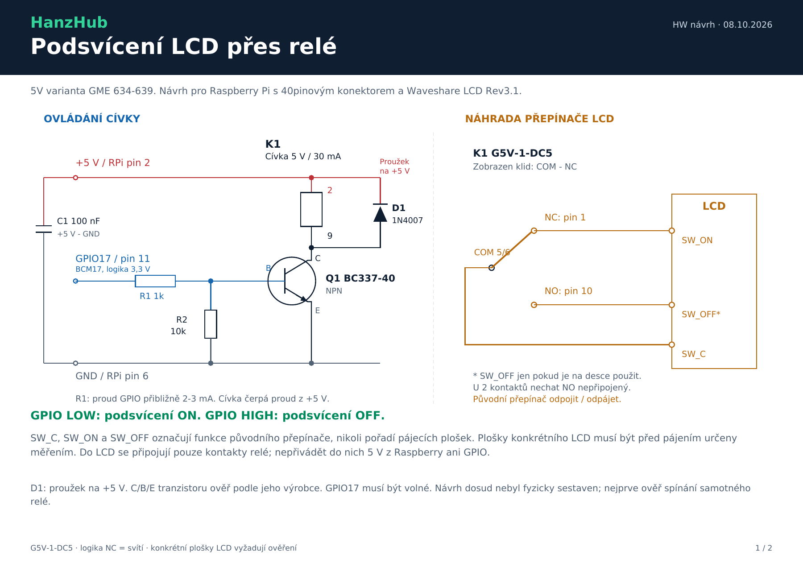

# Podsvícení Waveshare 7inch HDMI LCD (C) přes relé

Návrh pro HanzHub s 40pinovým konektorem Raspberry Pi a relé **Omron G5V-1-DC5**. GME kód **634-639** odpovídá 5V variantě. Na vlastním relé musí být označení **5 VDC**; jiné napětí cívky vyžaduje jiné napájení. Cívka 5V varianty má přibližně 167 ohmů a odebírá 30 mA.

[Schéma a součástky v PDF](backlight-relay.pdf)

## Princip

GPIO řídí tranzistor Q1, který spíná cívku relé z 5V větve. Kontakty relé **nahrazují původní mechanický přepínač podsvícení**. Klidový kontakt NC představuje původní polohu ON, kontakt NO původní polohu OFF. Bez buzení relé zůstává podsvícení zapnuté.

| GPIO17 | Cívka K1 | Spojení kontaktů | Podsvícení |
| --- | --- | --- | --- |
| LOW / 0 V | Vypnutá | COM - NC | ON |
| HIGH / 3,3 V | Zapnutá | COM - NO | OFF |

Jde o návrh zapojení, nikoli o již přidanou GPIO funkci aplikace. GPIO17 je navržený příklad: před montáží musí být volný, zejména po odstranění původního GPIO LCD a jeho overlay. Výchozí svícení platí při vypnuté cívce; software musí po startu nastavovat GPIO na LOW.

## Součástky

| Označení | Počet | Součástka | Účel |
| --- | ---: | --- | --- |
| K1 | 1 | Omron G5V-1-DC5, cívka 5 VDC | Relé, které už máš |
| Q1 | 1 | BC337-40, NPN, TO-92 | Spínání cívky |
| R1 | 1 | 1 kohm, 0,25 W | Omezení proudu do báze |
| R2 | 1 | 10 kohm, 0,25 W | Báze - emitor; vypíná tranzistor při neřízeném vstupu |
| D1 | 1 | 1N4007 | Ochrana tranzistoru při vypnutí cívky |
| C1 | 1 | Keramický 100 nF, alespoň 16 V | Mezi +5 V a GND blízko relé |
| C2 | 1 volitelně | Elektrolytický 47 uF / 16 V | Další filtrace +5 V; plus na +5 V, minus na GND |
| Montáž | Podle potřeby | Univerzální destička, vodiče, konektor, smršťovací bužírka | Pevné a izolované propojení |

R1 omezí proud GPIO přibližně na 2-3 mA. Samotná cívka odebírá 30 mA z napájecí větve, nikoli z GPIO.

## Zapojení ovládací části

Čísla 2/6/11 níže jsou **fyzická čísla na 40pinovém konektoru Raspberry**, GPIO17 je **BCM číslo**.

| Odkud | Kam |
| --- | --- |
| Raspberry pin 2, +5 V | K1 pin 2; katoda D1 (strana s proužkem); C1 a plus C2 |
| Raspberry pin 11, GPIO17 / BCM17 | R1 1 kohm; druhý konec R1 na bázi B tranzistoru Q1 |
| Q1 kolektor C | K1 pin 9; anoda D1 (strana bez proužku) |
| Q1 emitor E | Raspberry pin 6, GND |
| R2 10 kohm | Mezi bázi B a emitor E Q1 |
| C1; minus C2 | GND |

Cívka K1 je na pinech **2 a 9**, nemá vlastní polaritu. Polaritu celého zapojení určuje přidaná ochranná dioda: **proužek D1 patří na +5 V**. Vývody C/B/E BC337-40 ověř podle výrobce konkrétního tranzistoru. U citovaného onsemi provedení jsou 1 = C, 2 = B, 3 = E; pohled na pouzdro musí odpovídat jeho datasheetu.

## Pinout relé

| Pin K1 | Funkce |
| --- | --- |
| 2, 9 | Cívka |
| 5, 6 | COM, oba vývody jsou uvnitř trvale spojeny; stačí použít pin 5 |
| 1 | NC, spojeno s COM při vypnuté cívce |
| 10 | NO, spojeno s COM při zapnuté cívce |

Rozložení v PDF je **pohled zespodu na vývody relé**, s orientační značkou vlevo, stejně jako v datasheetu. Pohled shora je zrcadlový. Bez napájení lze multimetrem ověřit spojení 5-6 a 5-1; cívka mezi 2-9 má přibližně 167 ohmů.

## Připojení na LCD - určit kontakty před pájením

Na fotografii je Waveshare **Rev3.1** s mechanickým přepínačem. Funkce jeho konkrétních pájecích plošek není z této fotografie ověřená. Značky níže popisují funkci původního přepínače, **nikoli fyzické pořadí plošek na desce**:

| Funkce původního přepínače | Připojení relé |
| --- | --- |
| SW_C: společný kontakt přepínače | COM, K1 pin 5 |
| SW_ON: kontakt spojený se SW_C v poloze ON | NC, K1 pin 1 |
| SW_OFF: kontakt spojený se SW_C v poloze OFF, pokud je na PCB použit | NO, K1 pin 10 |

Pro tento návrh původní přepínač odpájej, případně odpoj jeho funkční vývody. Jeho izolované kontakty pak změř multimetrem v obou polohách; kovové kotvicí nožičky nejsou automaticky elektrické kontakty. U přepínače se dvěma funkčními kontakty při OFF zůstává obvod rozpojený: použij COM a NC, pin NO nepřipojuj. U SPDT se třemi použitými kontakty připoj také SW_OFF na NO, aby relé přesně reprodukovalo obě polohy.

**Nepropojuj naslepo dvě plošky při ponechaném přepínači.** Pokud jeho OFF poloha spojuje řízený bod s jinou větví, může paralelní propojení vytvořit zkrat. Do plošek LCD nepřiváděj externích 5 V ani GPIO; připojují se sem pouze oddělené kontakty relé.

Pájení a měření odporu prováděj s LCD i Raspberry odpojenými od napájení, USB a HDMI. Nejprve ověř relé samotné, včetně přepnutí COM z NC na NO při buzení; až potom připoj kontakty k LCD. Používej mechanické relé pro přepnutí ON/OFF, nikoli rychlé PWM.

## Stav ověření a zdroje

Elektrické parametry, pinout relé a logika návrhu jsou ověřeny podle dokumentace. Návrh **nebyl fyzicky sestaven** a pájecí plošky konkrétního LCD ještě vyžadují identifikaci. Pro jejich označení je potřeba detail přepínače z obou stran desky a ověření kontaktů multimetrem.

- [GME produkt 634-639: G5V-1-DC5](https://www.gme.cz/v/1502698/omron-g5v-1-dc5-rele-civka-5vdc-kontakt-125vac-05a-1x-prepinaci)
- [Datasheet dodaný uživatelem](https://img.gme.cz/files/eshop_data/eshop_data/4/634-639/dsh.634-639.1.pdf)
- [Omron G5V-1: parametry na str. 1, pohled na vývody na str. 4](https://omronfs.omron.com/en_US/ecb/products/pdf/en-g5v_1.pdf)
- [onsemi BC337: vývody tranzistoru](https://www.onsemi.com/pdf/datasheet/bc337-fsc-d.pdf)
- [Raspberry Pi: GPIO a fyzický pinout](https://www.raspberrypi.com/documentation/computers/raspberry-pi.html#gpio)
- [Waveshare 7inch HDMI LCD (C)](https://www.waveshare.com/wiki/7inch_HDMI_LCD_(C))
